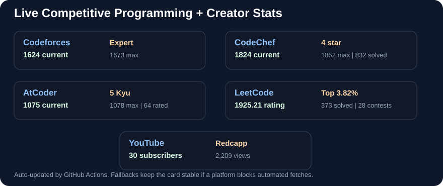
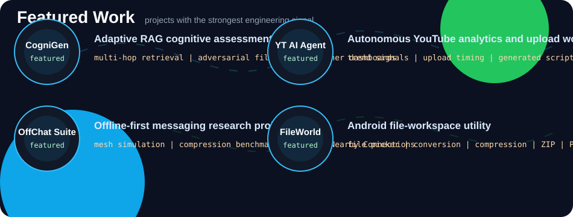
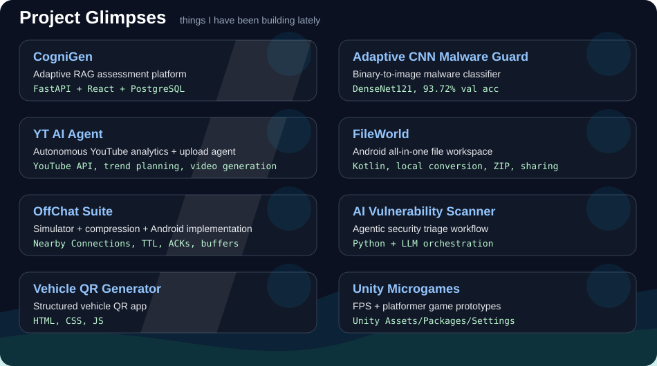
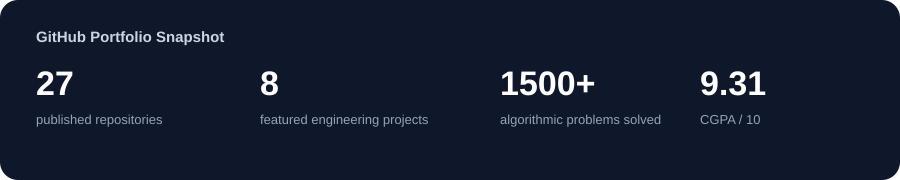

<div align="center">



[GitHub](https://github.com/redcappp) |
[LinkedIn](https://linkedin.com/in/divyansh-kumar-singh-chauhan) |
[YouTube: Redcapp](https://www.youtube.com/channel/UCRZ2r96UTZtdes8CFx9kSXA) |
[Email](mailto:divyansh23100@iiitnr.edu.in)

</div>

## Current Snapshot

```txt
Focused on: algorithms, ML systems, RAG, full-stack platforms, OS optimization
Education: B.Tech CSE, IIIT Naya Raipur, 2023-2027
CGPA: 9.31 / 10
Currently: Samsung PRISM R&D Intern
```

<div align="center">

| Platform | Current | Max | Problems / Signal |
|---|---:|---:|---:|
| [Codeforces](https://codeforces.com/profile/redcapp) | 1624 Expert | 1673 Expert | Active contests |
| [CodeChef](https://www.codechef.com/users/redcapp) | 1824 4 star | 1852 | 832 solved |
| [AtCoder](https://atcoder.jp/users/redcappp) | 1075 5 Kyu | 1078 | 64 rated matches |
| [LeetCode](https://leetcode.com/u/Redcapp/) | 1925.21 | 1925.21 | 373 solved, top 3.82% |

</div>

> Stats refreshed from public profiles/APIs on 2026-05-27.

## Live Programming Stats

<div align="center">



</div>

## Featured Work

<p align="center">
  
</p>

## Project Glimpses

<p align="center">
  
</p>

## Published Repositories

- [CogniGen Frontend](https://github.com/redcappp/cognigen-frontend)
- [CogniGen Backend](https://github.com/redcappp/cognigen-backend)
- [YT AI Agent](https://github.com/redcappp/yt-ai-agent)
- [FileWorld](https://github.com/redcappp/fileworld)
- [OffChat Mesh Simulator](https://github.com/redcappp/offchat-mesh-simulator)
- [OffChat Android](https://github.com/redcappp/offchat-android)
- [Vehicle QR Code Generator](https://github.com/redcappp/vehicle-qr-code-generator)
- [Adaptive CNN Malware Guard](https://github.com/redcappp/Adaptive-CNN-Malware-Guard)
- [AI Vulnerability Scanner Agent](https://github.com/redcappp/ai-vuln-scanner-agent)
- [Unity Mobile 3D Starter](https://github.com/redcappp/unity-mobile-3d-starter)
- [Unity Vehicle Manager](https://github.com/redcappp/unity-vehicle-manager)
- [Unity Sample Scene Prototype 2](https://github.com/redcappp/unity-sample-scene-prototype-2)
- [Unity Sample Scene Prototype 3](https://github.com/redcappp/unity-sample-scene-prototype-3)
- [Unity Visual Scene Prototype](https://github.com/redcappp/unity-visual-scene-prototype)
- [Unity FPS Microgame](https://github.com/redcappp/unity-fps-microgame)
- [Unity Platformer Space Microgame](https://github.com/redcappp/unity-platformer-space-microgame)

## Tech Stack

```txt
C++ | Python | JavaScript | TypeScript | React | FastAPI | Node.js
PyTorch | TensorFlow | scikit-learn | RAG | PostgreSQL | MongoDB
Docker | Linux | GitHub Actions | Unity | OS internals
```

## GitHub Activity

<div align="center">



</div>

## Competitive Programming

- [Codeforces: redcapp](https://codeforces.com/profile/redcapp)
- [CodeChef: redcapp](https://www.codechef.com/users/redcapp)
- [AtCoder: redcappp](https://atcoder.jp/users/redcappp)
- [LeetCode: Redcapp](https://leetcode.com/u/Redcapp/)

## YouTube

[Redcapp Competitive Programming](https://www.youtube.com/channel/UCRZ2r96UTZtdes8CFx9kSXA) - Codeforces, CodeChef, AtCoder problem breakdowns and algorithmic strategy.
