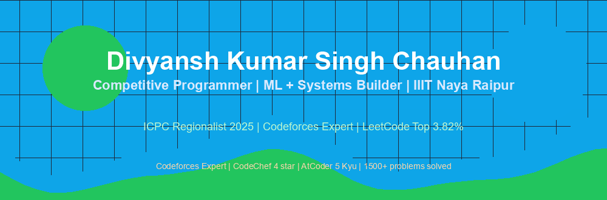
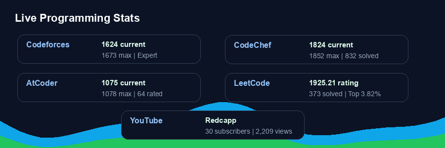
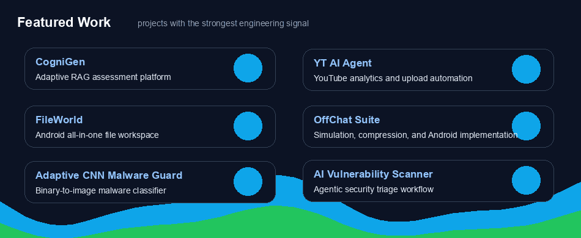

<div align="center">



[GitHub](https://github.com/redcappp) |
[LinkedIn](https://linkedin.com/in/divyansh-kumar-singh-chauhan) |
[YouTube: Redcapp](https://www.youtube.com/channel/UCRZ2r96UTZtdes8CFx9kSXA) |
[Email](mailto:divyansh23100@iiitnr.edu.in)

</div>

## Current Snapshot

```txt
Focused on: algorithms, ML systems, RAG, full-stack platforms, OS optimization
Education: B.Tech CSE, IIIT Naya Raipur, 2023-2027
CGPA: 9.31 / 10
Currently: Samsung PRISM R&D Intern
```

## Live Programming Stats

<div align="center">



</div>

| Platform | Current | Max | Problems / Signal |
|---|---:|---:|---:|
| [Codeforces](https://codeforces.com/profile/redcapp) | 1624 Expert | 1673 Expert | Active contests |
| [CodeChef](https://www.codechef.com/users/redcapp) | 1824 4 star | 1852 | 832 solved |
| [AtCoder](https://atcoder.jp/users/redcappp) | 1075 5 Kyu | 1078 | 64 rated matches |
| [LeetCode](https://leetcode.com/u/Redcapp/) | 1925.21 | 1925.21 | 373 solved, top 3.82% |

## Featured Work

<div align="center">



</div>

| Project | What It Does | Links |
|---|---|---|
| CogniGen | Adaptive RAG assessment platform with teacher dashboards, student quizzes, PDF generation, and adversarial question filtering. | [Frontend](https://github.com/redcappp/cognigen-frontend) · [Backend](https://github.com/redcappp/cognigen-backend) |
| YT AI Agent | YouTube analytics, trend planning, content generation, metadata, and upload automation through official APIs. | [Repository](https://github.com/redcappp/yt-ai-agent) |
| FileWorld | Android file workspace for local conversion, compression, ZIP creation, sharing, and Play Store-ready assets. | [Repository](https://github.com/redcappp/fileworld) |
| OffChat Suite | Offline communication project with simulator, compression benchmark, and Android Nearby Connections implementation. | [Simulator](https://github.com/redcappp/offchat-mesh-simulator) · [Android](https://github.com/redcappp/offchat-android) |
| Adaptive CNN Malware Guard | Malware classifier that converts binaries into image representations and evaluates CNN architectures. | [Repository](https://github.com/redcappp/Adaptive-CNN-Malware-Guard) |
| AI Vulnerability Scanner Agent | Agentic security triage workflow for vulnerability analysis and repeatable scanner experiments. | [Repository](https://github.com/redcappp/ai-vuln-scanner-agent) |

## Portfolio Snapshot

<div align="center">


</div>

## Published Repositories

| Apps and AI | Systems and Research | Games and Experiments |
|---|---|---|
| [YT AI Agent](https://github.com/redcappp/yt-ai-agent) | [CogniGen Backend](https://github.com/redcappp/cognigen-backend) | [Unity FPS Microgame](https://github.com/redcappp/unity-fps-microgame) |
| [FileWorld](https://github.com/redcappp/fileworld) | [CogniGen Frontend](https://github.com/redcappp/cognigen-frontend) | [Unity Platformer Space Microgame](https://github.com/redcappp/unity-platformer-space-microgame) |
| [Vehicle QR Code Generator](https://github.com/redcappp/vehicle-qr-code-generator) | [OffChat Mesh Simulator](https://github.com/redcappp/offchat-mesh-simulator) | [Unity Vehicle Manager](https://github.com/redcappp/unity-vehicle-manager) |
| [AI Vulnerability Scanner Agent](https://github.com/redcappp/ai-vuln-scanner-agent) | [OffChat Android](https://github.com/redcappp/offchat-android) | [Unity Visual Scene Prototype](https://github.com/redcappp/unity-visual-scene-prototype) |
| [Adaptive CNN Malware Guard](https://github.com/redcappp/Adaptive-CNN-Malware-Guard) | [Quant](https://github.com/redcappp/Quant) | [Unity Mobile 3D Starter](https://github.com/redcappp/unity-mobile-3d-starter) |

## Tech Stack

```txt
C++ | Python | JavaScript | TypeScript | Kotlin | React | FastAPI | Node.js
PyTorch | TensorFlow | scikit-learn | RAG | PostgreSQL | MongoDB | SQLite
Docker | Linux | GitHub Actions | Unity | Android | OS internals
```

## Competitive Programming

- [Codeforces: redcapp](https://codeforces.com/profile/redcapp)
- [CodeChef: redcapp](https://www.codechef.com/users/redcapp)
- [AtCoder: redcappp](https://atcoder.jp/users/redcappp)
- [LeetCode: Redcapp](https://leetcode.com/u/Redcapp/)

## YouTube

[Redcapp Competitive Programming](https://www.youtube.com/channel/UCRZ2r96UTZtdes8CFx9kSXA) - Codeforces, CodeChef, AtCoder problem breakdowns and algorithmic strategy.
